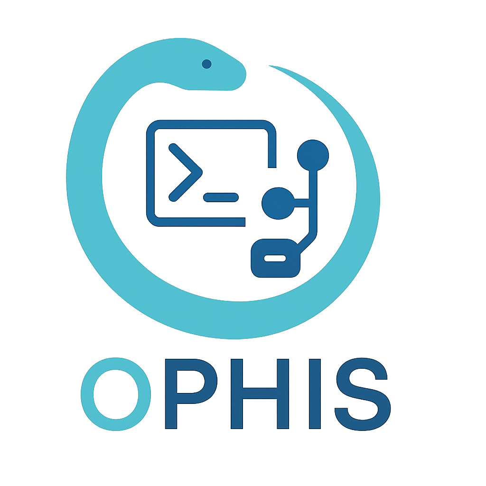

**Transform any Cobra CLI application into an MCP (Model Context Protocol) server**

## How it Works

- **Command Tree Traversal**: The `tools.FromRootCmd()` function recursively walks through your `cobra.Command` tree
- **Metadata Extraction**: For each command, command descriptions, flags, and usage information are captured and converted to an `mcp.Tool`
- **Bridge Server**: An mcp server converts tool calls back into `cobra.Commands`, and runs them
- **Prebuilt Commands**: Prebuilt commands install the server into Claude and start the server

## Quick Start

### 1. Implement Command Factory.

The `CommandFactory` interface provides flexibility for command creation and execution:

```go
type CommandFactory interface {
    // Tools returns the list of available MCP tools
    Tools() []tools.Tool
    
    // New creates a fresh command instance and execution function
    New() (*cobra.Command, CommandExecFunc)
}
```

An example `CommandFactory`:

```go
package main

import (
    "context"
    "strings"

    "github.com/mark3labs/mcp-go/mcp"
    "github.com/njayp/ophis/bridge"
    "github.com/njayp/ophis/tools"
    "github.com/spf13/cobra"
)

// CommandFactory implements the bridge.CommandFactory interface.
// It stores a root cmd on creation so it is available later for Tool generation.
type CommandFactory struct {
    rootCmd *cobra.Command
}

// Tools generates MCP server tools using the stored root cmd.
func (f *CommandFactory) Tools() []tools.Tool {
    return tools.FromRootCmd(f.rootCmd)
}

// New generates a new instance of the root cmd, and uses a strings.Builder
// to gather the output of the cmd. 
func (f *CommandFactory) New() (*cobra.Command, bridge.CommandExecFunc) {
    var output strings.Builder
    // your func that generates a new root cmd
    rootCmd := createYourExistingCommand()
    rootCmd.SetOut(&output)
    rootCmd.SetErr(&output)

    execFunc := func(ctx context.Context, cmd *cobra.Command) *mcp.CallToolResult {
        err := cmd.ExecuteContext(ctx)
        if err != nil {
            return mcp.NewToolResultErrorFromErr("Failed to execute command", err)
        }
        
        return mcp.NewToolResultText(output.String())
    }

    return rootCmd, execFunc
}
```

### 2. Basic Integration

Add MCP server capability to your existing Cobra application:

```go
package main

import (
    "github.com/njayp/ophis/bridge"
    "github.com/njayp/ophis/mcp"
    "github.com/spf13/cobra"
)

func main() {
    // You can also add mcp.Command to your root cmd inside createYourExistingCommand
    rootCmd := createYourExistingCommand()
    
    // Create a command factory
    factory := &MyCommandFactory{
        rootCmd: rootCmd,
    }
    
    // Create MCP server config
    config := &bridge.Config{
        AppName:    "my-cli-server",
        AppVersion: "1.0.0",
        LogLevel:   "info",
    }
    
    rootCmd.AddCommand(mcp.Command(factory, config))
    
    if err := rootCmd.Execute(); err != nil {
        os.Exit(1)
    }
}
```

### 3. Enable in Claude Desktop

Once your application is built, enable it as an MCP server:

```bash
# Enable your CLI as an MCP server in Claude Desktop
./your-cli mcp claude enable
```

## Contributing

See [CONTRIBUTING.md](CONTRIBUTING.md)